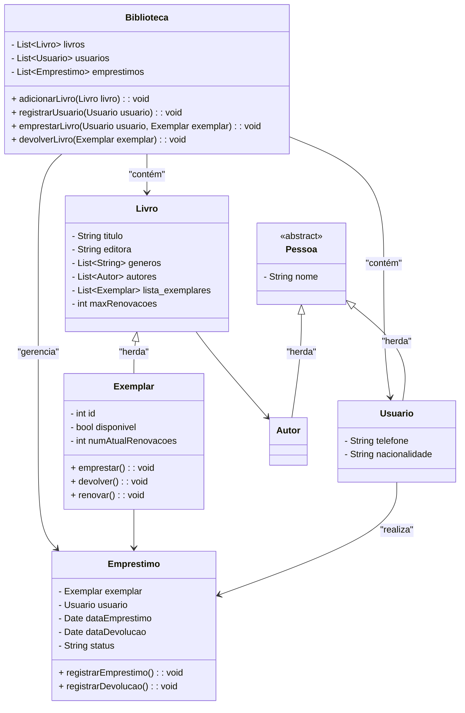

# WoMakers Code 🦋 - Bootcamp BackEnd - Python Django (SQUAD - ENIAC)

🦋 Este repositório contém o Desafio Programação Orientada a Objeto desevolvido pelo Squad ENIAC durante o Bootcamp de Python & Django oferecido pela WoMakersCode. O objetivo deste bootcamp é fornecer uma base sólida em Python e Django, capacitando as mulheres a desenvolverem aplicações web completas 🦋

## Desafio Programação Orientada a Objeto

### 📜 Descrição

Este desafio abrange conceitos fundamentais de programação orientada a objetos, como Classes, Herança e Encapsulamento.
  
#### 📚 Gerenciamento de Biblioteca:

📋 **Vamos criar um sistema orientado a objetos para representar um sistema de biblioteca seguindo os requisitos abaixo:**

- 1️⃣. Cada livro pode ter um ou mais autores.

- 2️⃣. A biblioteca controla apenas o nome, o telefone e a nacionalidade de cada usuário.

- 3️⃣. Cada livro tem um título, editora, uma lista de gêneros aos quais pertence e uma lista de exemplares disponíveis.

- 4️⃣. Quando um exemplar é emprestado, ele é removido da lista de exemplares disponíveis.

- 5️⃣. Alguns livros podem ter um número máximo de renovações permitidas.

- 6️⃣. A biblioteca mantém um registro de todos os empréstimos realizados, incluindo detalhes como data de empréstimo, data de devolução e estado do exemplar (por exemplo, emprestado ou devolvido).

> 🖋️ **Nota:**  _Para modelar o sistema, utilize obrigatoriamente os conceitos de classe, herança, propriedade, encapsulamento e classe abstrata._

### 🛠️ Modelando o Sistema

O sistema de gerenciamento de biblioteca é modelado para gerenciar livros, usuários e empréstimos. A classe Biblioteca centraliza a administração de livros, usuários e registros de empréstimos.

> 💡 _O diagrama UML acima descreve a estrutura do sistema de gerenciamento de biblioteca, detalhando as principais classes e suas interações._

- **Biblioteca**: Gerencia livros, usuários e empréstimos. Permite adicionar livros, registrar usuários e gerenciar o processo de empréstimo e devolução.
- **Livro**: Contém informações como título, editora, gêneros, autores e uma lista de exemplares.
- **Exemplar**: Herda de **Livro** e adiciona atributos para controle de disponibilidade e métodos para emprestar, devolver e renovar.
- **Pessoa** (classe abstrata): Base para as classes **Usuário** e **Autor**, contendo o atributo nome.
- **Usuário**: Herda de **Pessoa** e adiciona informações de contato e nacionalidade.
- **Autor**: Herda de **Pessoa** e lista os livros que escreveu.
- **Empréstimo**: Relaciona um exemplar a um usuário e controla as datas e status do empréstimo.

### Relacionamentos

- **Biblioteca** contém livros e usuários, e gerencia empréstimos.
- Cada livro pode ter múltiplos autores.
- **Exemplar** é um tipo de **Livro** e pode ser emprestado.

## 👥 SQUAD ENIAC - Integrantes 

- Ana Julia Rauber - [GitHub](https://github.com/anajuliarauber) - [Likedin](https://www.linkedin.com/in/ana-julia-rauber/);
- Angelica Conceição Salvino da Silva - [GitHub](https://github.com/AngelicaSalvino) - [Likedin](https://www.linkedin.com/in/angelica-salvino/);
- Caroline Souza Camargo - [GitHub](https://github.com/Caroline-Camargo) - [Likedin](https://www.linkedin.com/in/caroline-souza-camargo-023b54164/);
- Fabiana Maria Ignácio da Silva - [GitHub](https://github.com/Ignacio-fabianamaria) - [Likedin](https://www.linkedin.com/in/fabianaignacio/);
- Kassia do Espirito Santo - [GitHub](https://github.com/KassiaES) - [Likedin](https://www.linkedin.com/in/kassia-es);
- Laysa Alexia Lima Cipriano - [GitHub](https://github.com/LayCipriano) - [Likedin](https://www.linkedin.com/in/lay-cipriano/);
- Marina Cesconeto dos Santos (líder do squad) - [GitHub](https://github.com/marina6coneto) - [Likedin](https://www.linkedin.com/in/marina-cesconeto-dos-santos-a17563216/);
- Natalia Gomes Vitório - [GitHub]() - [Likedin]();
- Rosana de Souza Brito - [GitHhub](https://github.com/RosanaBrito) - [Likedin](https://www.linkedin.com/in/rosanadesouzabrito/);

### 🤝 Divisão das Tarefas

A divisão das tarefas foi feita em uma reunião colaborativa, na qual discutimos detalhadamente a modelagem do sistema e delegamos as responsabilidades. A escolha da atividade **Gerenciamento de Biblioteca** foi realizada por meio de uma enquete no Discord (aplicativo oficial de comunicação do Bootcamp). A distribuição das tarefas ficou organizada da seguinte forma:

- **Classe Empréstimo**: Carol
- **Classe Exemplar**: Kassia
- **Classe Biblioteca**: Fabiana e Ana Julia
- **Classe Autor**: Laysa
- **Classe Usuário**: Rosana
- **Classe Livro**: Marina
- **Classe Pessoa**: Angélica
